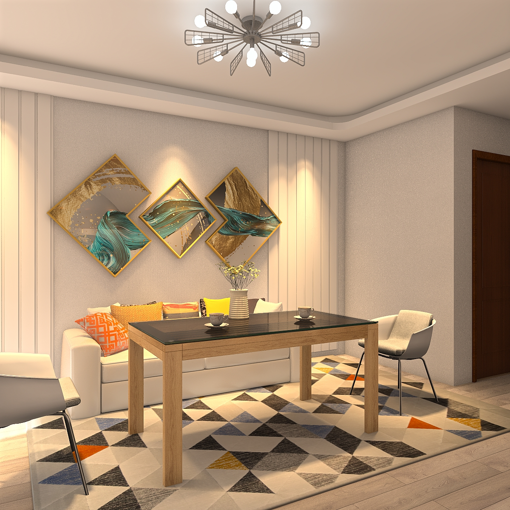
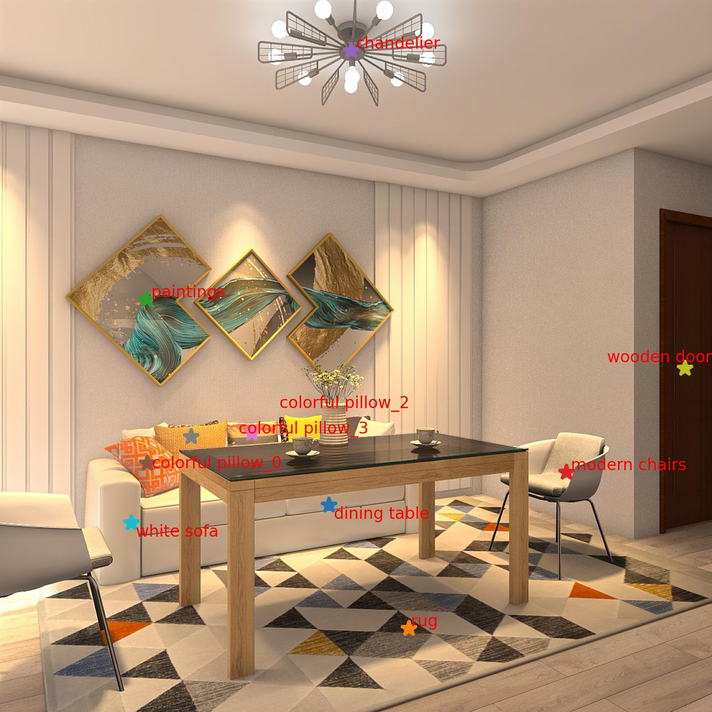

<div align="center">
  <br>
  
  <br>
  <h2>ROOT: VLM-based System for Indoor Scene Understanding and Beyond</h2>
</div>

<div align="center">

**Yonghui Wang<sup>1,2</sup>, Shi-Yong Chen<sup>2</sup>, Zhenxing Zhou<sup>2</sup>, Siyi Li<sup>2</sup>, Haoran Li<sup>1,2</sup>, Wengang Zhou<sup>1</sup>, Houqiang Li<sup>1</sup>**  
<sup>1</sup> University of Science and Technology of China (USTC)  <sup>2</sup> Game AI Center, Tencent IEG  

[](https://arxiv.org/abs/2411.15714) [](https://harrytea.github.io/ROOT/) [](https://huggingface.co/harrytea/ROOT) [](./LICENSE)

</div>

---

🎉 The Qwen2-VL and Intern2-VL checkpoints have released! [huggingface ckpt](https://huggingface.co/harrytea/ROOT)

## 💡 Introduction

<div align="center">
  
</div>

**ROOT** is a **Vision-Language Model (VLM)**-based system for **indoor scene understanding**.  
It combines **GPT-4V** with vision models to detect objects, extract spatial metadata, and generate hierarchical scene graphs, which handle relationships using support, contain, hang and attach.

<div align="center">
  
</div>

---

## 🔍 Features

- **Object Perception**: Detects indoor objects using GPT-4V.
- **Indoor Scene Parsing**: Extracts object bounding boxes, masks, etc.
- **Hierarchical Scene Graphs**: Captures spatial relationships such as support, contain, hang, and attach.
- **Distance Estimation**: Estimates distances between objects.
- **Extensibility**: Supports downstream tasks like 3D scene generation and scene-based Q&A.


---

## 🚀 Quickstart

1. Download the [depth_anything_metric_depth_indoor.pt](https://huggingface.co/spaces/LiheYoung/Depth-Anything/blob/main/checkpoints_metric_depth/depth_anything_metric_depth_indoor.pt) and place it in the `foundation/Depth_Anything` directory.  

2. Download the Qwen2-VL Model from Our [huggingface](https://huggingface.co/harrytea/ROOT) and put it in `ckpts/Qwen2-VL-7B-FULL-full`. Additionally, you need to download the [Qwen2.5](https://huggingface.co/Qwen/Qwen2.5-3B-Instruct) model and put it in `ckpts/Qwen2.5-3B-Instruct`

3. Add the Azure OpenAI token to the environment variable OPENAI_API_KEY, and uncomment line 28 of `api/gpt4v_azure.py` and comment out line 29. Alternatively, you can directly add your api_key to the token parameter in line 24 of `api/gpt4v_azure.py`

4. **Run the System**  
   ```bash
   # Run with main script
   python main.py

   # Run with demo app
   python app.py
   ```

---

## 🔧 Finetuning

Learn how to finetune your own SceneVLM for custom indoor environments, using Qwen2-VL as an example，you can download our [ckpt](https://huggingface.co/harrytea/ROOT) here.

### Data Preparation

1. First, execute the first two steps of our method - iterative object perception and indoor scene parsing. This will obtain various meta information about the indoor scene, including:
   - Object list
   - Masks
   - Bounding boxes
   - Depth information
   - Distance information between objects

**Note**: At this stage, you will obtain distance information between objects. You can use this information to either:
- Train SceneVLM for distance prediction capabilities
- Directly used for your downstream tasks

The following example demonstrates the hierarchical scene graph generation, but the same process applies for distance prediction.

2. Using the object names and their masks, use our `utils/show_point.py` script to generate training input images. As shown below, the left is the original image and the right is the input image for SceneVLM:

<div align="center">
  
  
</div>

3. Construct the training data as follows:

<details>
<summary>Click to expand the complete scene graph data structure</summary>

```json
{
    "floor": {
        "support": [
            {
                "rug": {
                    "support": [
                        {
                            "dining table": {}
                        },
                        {
                            "white sofa": {
                                "support": [
                                    {
                                        "colorful pillow_0": {}
                                    },
                                    {
                                        "colorful pillow_3": {}
                                    },
                                    {
                                        "colorful pillow_2": {}
                                    }
                                ]
                            }
                        },
                        {
                            "modern chairs": {}
                        }
                    ]
                }
            }
        ]
    },
    "ceiling": {
        "attach": [
            {
                "chandelier": {}
            }
        ]
    },
    "wall": {
        "hang": [
            {
                "paintings": {}
            },
            {
                "wooden door": {}
            }
        ]
    }
}
```
</details>

During training, we include Chain-of-Thought (CoT) data. The CoT description is generated by prompting GPT-4 with the template from `prompt/cot_prompt.txt` along with the above JSON structure. Example CoT output:

> The rug is supported by the floor, and on top of the rug, there is a dining table, a white sofa, and modern chairs. The white sofa supports colorful pillow_0, colorful pillow_3, and colorful pillow_2. The chandelier is attached to the ceiling. On the wall, paintings are hanging, as well as a wooden door.

4. Format your annotation file as follows:
```json
[
    {
        "messages": [
            {
                "content": "<image>\n + [ssg_prompt.py]",
                "role": "user"
            },
            {
                "content": "[cot]\n + ```json\n[json_answer]```",
                "role": "assistant"
            }
        ],
        "images": [
            "[your_img_path]"
        ]
    },
    {},
]
```

### Training

Follow the Qwen2-VL finetuning method from [LLaMA-Factory](https://github.com/hiyouga/LLaMA-Factory) to train your model.


**Note**: If you only want to obtain the indoor hierarchical scene graph and already have a list of indoor objects (instead of generating the object list through our first step of iterative object perception), you only need to use GroundingDINO and SAM for detection and segmentation, then manually construct JSON data to fine-tune based on our weights. Based on our experience, just a few thousand data samples can achieve very good scene graph generation results.


---

## 📓 Jupyter Notebook Demo

Explore our interactive demo using Jupyter Notebook:  
- **Example Notebook**: `demo.ipynb`  
- **Features**: Step-by-step guidance and usage examples.

---

## 🗂️ Repository Structure

```plaintext
ROOT-VLM-System/
├── api/                   # VLM api
├── asset/                 # Icons, architecture diagrams, and example outputs
├── foundation/            # Core models and dependencies
├── demo.ipynb/            # Jupyter notebook demos
├── main.py                # Main entry point for the system
├── LICENSE                # Project license
└── README.md              # Documentation
```

---

## 📃 TODO

- [x] Indoor object perception  
- [x] Indoor scene parsing  
- [x] Scene graph generation  
- [x] Distance estimation  
- [x] SceneVLM model weights  
- [ ] Docker support  

---

## 🐳 Docker Support (Coming Soon)

We are working on providing a Docker environment for seamless deployment. Stay tuned!

---

## 🎉 Acknowledgements

We extend our gratitude to the authors of the following projects for their foundational contributions:

- **[GroundingDINO](https://github.com/IDEA-Research/GroundingDINO)**: Scene parsing.  
- **[Segment-Anything](https://github.com/facebookresearch/segment-anything)**: Object segmentation.  
- **[Depth-Anything](https://github.com/LiheYoung/Depth-Anything)**: Depth estimation.  
- **[InternVL](https://github.com/OpenGVLab/InternVL)**: Fine-tuning base.
- **[Qwen2-VL](https://github.com/QwenLM/Qwen2-VL)**: Fine-tuning base.
- **[GPT-4V](https://openai.com/index/gpt-4v-system-card/)**: Vision-language reasoning.

---

## 📑 Citation

If you find our work helpful in your research, please consider 🌟 staring this repository and citing us :

```bibtex
@article{wang2024rootvlmbasedindoor,
  title={ROOT: VLM-based System for Indoor Scene Understanding and Beyond}, 
  author={Yonghui Wang and Shi-Yong Chen and Zhenxing Zhou and Siyi Li and Haoran Li and Wengang Zhou and Houqiang Li},
  journal={arXiv preprint arXiv:2411.15714},
  year={2024}
}
```

---

<div align="center">
  <b></b>  
</div>
