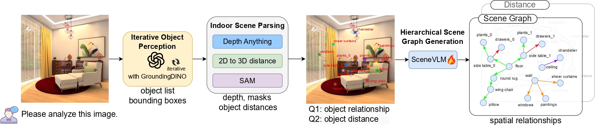

<div align="center">
  <br>
  
  <br>
  <h2>ROOT: VLM-based System for Indoor Scene Understanding and Beyond</h2>
</div>

<div align="center">

**Yonghui Wang<sup>1,2</sup>, Shi-Yong Chen<sup>2</sup>, Zhenxing Zhou<sup>2</sup>, Siyi Li<sup>2</sup>, Haoran Li<sup>1,2</sup>, Wengang Zhou<sup>1</sup>, Houqiang Li<sup>1</sup>**  
<sup>1</sup> University of Science and Technology of China (USTC)  <sup>2</sup> Game AI Center, Tencent IEG  

[](https://arxiv.org/abs/2411.15714) [](https://harrytea.github.io/ROOT/) [](https://huggingface.co/harrytea/ROOT) [](./LICENSE)

</div>

---

🎉 The Qwen2-VL and Intern2-VL checkpoints have released! [huggingface ckpt](https://huggingface.co/harrytea/ROOT)

## 💡 Introduction

<div align="center">
  
</div>

**ROOT** is a **Vision-Language Model (VLM)**-based system for **indoor scene understanding**.  
It combines **GPT-4V** with vision models to detect objects, extract spatial metadata, and generate hierarchical scene graphs, which handle relationships using support, contain, hang and attach.

<div align="center">
  
</div>

---

## 🔍 Features

- **Object Perception**: Detects indoor objects using GPT-4V.
- **Indoor Scene Parsing**: Extracts object bounding boxes, masks, etc.
- **Hierarchical Scene Graphs**: Captures spatial relationships such as support, contain, hang, and attach.
- **Distance Estimation**: Estimates distances between objects.
- **Extensibility**: Supports downstream tasks like 3D scene generation and scene-based Q&A.


---

## 🚀 Quickstart

1. **Download Required Model**  
   Download the [depth_anything_metric_depth_indoor.pt](https://huggingface.co/spaces/LiheYoung/Depth-Anything/blob/main/checkpoints_metric_depth/depth_anything_metric_depth_indoor.pt) and place it in the `foundation/Depth_Anything` directory.  

2. **Download the Qwen2-VL Model from Our huggingface**

3. **Run the System**  
   ```bash
   # Run with main script
   python main.py

   # Run with demo app
   python app.py
   ```

### Jupyter Notebook Demo

Explore our interactive demo using Jupyter Notebook:  
- **Example Notebook**: `demo.ipynb`  
- **Features**: Step-by-step guidance and usage examples.

---

## 🗂️ Repository Structure

```plaintext
ROOT-VLM-System/
├── api/                   # VLM api
├── asset/                 # Icons, architecture diagrams, and example outputs
├── foundation/            # Core models and dependencies
├── demo.ipynb/            # Jupyter notebook demos
├── main.py                # Main entry point for the system
├── LICENSE                # Project license
└── README.md              # Documentation
```

---

## 📃 TODO

- [x] Indoor object perception  
- [x] Indoor scene parsing  
- [x] Scene graph generation  
- [x] Distance estimation  
- [x] SceneVLM model weights  
- [ ] Docker support  

---

## 🐳 Docker Support (Coming Soon)

We are working on providing a Docker environment for seamless deployment. Stay tuned!

---

## 🎉 Acknowledgements

We extend our gratitude to the authors of the following projects for their foundational contributions:

- **[GroundingDINO](https://github.com/IDEA-Research/GroundingDINO)**: Scene parsing.  
- **[Segment-Anything](https://github.com/facebookresearch/segment-anything)**: Object segmentation.  
- **[Depth-Anything](https://github.com/LiheYoung/Depth-Anything)**: Depth estimation.  
- **[InternVL](https://github.com/OpenGVLab/InternVL)**: Fine-tuning base.
- **[Qwen2-VL](https://github.com/QwenLM/Qwen2-VL)**: Fine-tuning base.
- **[GPT-4V](https://openai.com/index/gpt-4v-system-card/)**: Vision-language reasoning.

---

## 📑 Citation

If you find our work helpful in your research, please consider 🌟 staring this repository and citing us :

```bibtex
@article{wang2024rootvlmbasedindoor,
  title={ROOT: VLM-based System for Indoor Scene Understanding and Beyond}, 
  author={Yonghui Wang and Shi-Yong Chen and Zhenxing Zhou and Siyi Li and Haoran Li and Wengang Zhou and Houqiang Li},
  journal={arXiv preprint arXiv:2411.15714},
  year={2024}
}
```

---

<div align="center">
  <b></b>  
</div>
